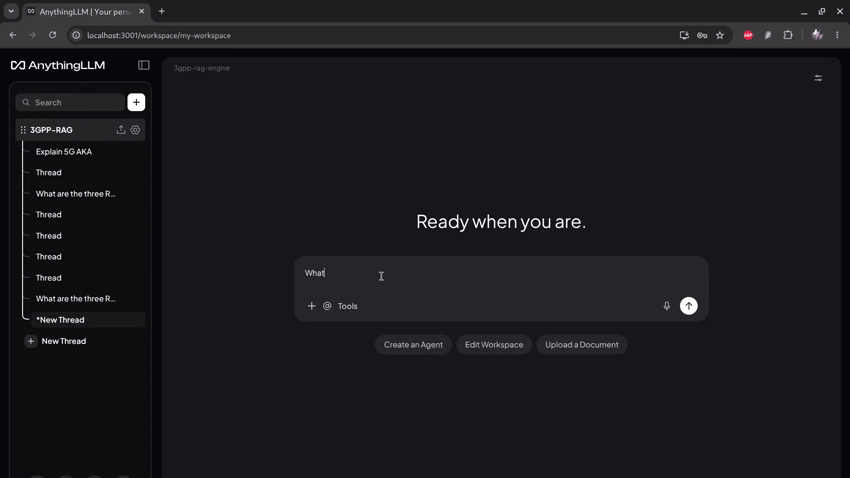

# 3GPP Local RAG Pipeline & AnythingLLM Integration



##  Overview
The **3GPP RAG Pipeline** is a fully local, privacy-preserving Retrieval-Augmented Generation (RAG) engine specifically designed to navigate, process, and query complex 3GPP telecommunication specifications (e.g., 5G NR Rel-18). 

By leveraging local LLMs (Qwen 2.5 Coder), an advanced vector database (Qdrant), and a custom LangGraph/FastAPI backend, this project allows telecommunication engineers and researchers to ask complex protocol questions (e.g., *"What protocol does the UE use to request a paging response in RRC_IDLE?"*) and receive highly accurate, cited answers backed directly by the 3GPP specifications.

The backend is seamlessly integrated with **AnythingLLM** as the frontend UI, utilizing an OpenAI-compatible Server-Sent Events (SSE) streaming API.

## Architecture & Tech Stack

This project is entirely containerized using Docker Compose and consists of the following isolated services:

1. **`rag-app` (FastAPI / LangGraph)**: The core engine. It handles downloading specifications, chunking them into Markdown, generating embeddings, and orchestrating the RAG retrieval/generation pipeline. It exposes an OpenAI-compatible `/v1/chat/completions` endpoint.
2. **`anythingllm` (Frontend UI)**: A powerful local LLM GUI that connects to the `rag-app` over the Docker bridge network.
3. **`qdrant` (Vector Database)**: High-performance vector database with disk persistence for storing and retrieving 3GPP document chunks.
4. **`ollama` (Local Inference)**: Hosts the local embedding and generation models.
5. **`model-init`**: A one-time provisioner that automatically pulls required models (`nomic-embed-text`, `qwen2.5-coder:1.5b`, `qwen2.5-coder:7b`) into Ollama upon first boot.

##  Prerequisites
* **Docker & Docker Compose** installed on your host machine.
* At least **16GB RAM** (32GB+ recommended) to run the Qwen 7B and 1.5B models concurrently.
* *(Optional but Recommended)* NVIDIA GPU with Docker GPU passthrough configured.

---
##  How to Run
There are two primary ways to run this project depending on whether you already have the 3GPP specifications downloaded and ingested into the vector database.
### Scenario A: Download, Ingest, and Serve (Full Setup)
Use this method if you are starting from scratch and need to build your knowledge base before serving the UI.

**1. Start the core infrastructure (Background services)**
First, bring up the database and LLM inference engine. Wait a moment for `model-init` to finish downloading the Ollama models.

```bash
docker compose up -d qdrant ollama model-init
```

2. **Download 3GPP Specifications**
Use the rag-app container to download the specific 3GPP series (e.g., Series 38 for 5G NR radio technology) and convert them to Markdown.

```Bash
docker compose run --rm rag-app download --release Rel-18 --series 38 --out-dir ./output_markdowns
```

3. **Initialize the Vector Database**
Create the necessary collections and indexes in Qdrant.

```Bash
docker compose run --rm rag-app init-db
```

4. **Ingest the Specifications**
Chunk the downloaded Markdown files, generate embeddings via Ollama, and load them into Qdrant.

```Bash
docker compose run --rm rag-app ingest --dir ./output_markdowns --release Rel-18
```

5. **Start the Server and UI**
Once ingestion is complete, start the FastAPI RAG backend and AnythingLLM frontend.

```Bash
docker compose up -d rag-app anythingllm
```

### Scenario B: Serve (Everyday Usage)
If you have already downloaded and ingested the documents into your persistent Docker volumes (qdrant_storage), you only need a single command to spin up the entire application.

```Bash
docker compose up -d
```

This will start Qdrant, Ollama, the FastAPI rag-app server, and AnythingLLM simultaneously.

## Connecting AnythingLLM to the RAG Engine
Because AnythingLLM and the RAG API run inside the same Docker network, you must configure AnythingLLM to route traffic internally rather than looking for real OpenAI servers.

1. Open your browser and go to http://localhost:3001 to access AnythingLLM.
2. Click the Settings (wrench icon) in the bottom left.
3. Navigate to LLM Provider.
4. Select Generic OpenAI from the provider list.
5. Apply the following configuration exactly:
    - Base URL: http://rag-app:8000/v1 (Do not use localhost here)
     - API Key: sk-dummy-key (You MUST enter this. Leaving it blank will cause AnythingLLM to ignore the Base URL and reach out to the real OpenAI servers, resulting in a 401 error).
    - Chat Model Name: 3gpp-rag-engine
     - Model Context Window: 4096
     - Max Tokens: 1024

    2. Click Save Changes.

### Workspace Configuration:
    - Navigate to your specific Workspace Settings (gear icon next to your workspace name).
    - Ensure the Workspace Chat Model is set to 3gpp-rag-engine.

## CLI Command Reference
The app.py script acts as a master controller. It accepts the following commands: 
- **download**: Fetches 3GPP specs and converts them to Markdown.
	- Options: **--release, --series, --all-series, --out-dir**

- **init-db:** Drops existing tables and initializes fresh Qdrant tables & indexes.
- **ingest**: Ingests a raw specification document or directory into the vector DB.
	- Options: **--file, --dir, --spec, --release, --reset-db**
- evaluate: Runs an LLM-as-a-judge evaluation harness against golden QA pairs.
	- Options: **--golden**

- **serve:** Starts the FastAPI server (/v1/chat/completions) for AnythingLLM (Runs on port 8000 by default).

## Troubleshooting
- **AnythingLLM says "TypeError: fetch failed" or "STREAM ABORTED":** Ensure your **app.py** is returning a **StreamingResponse**. AnythingLLM strictly requires Server-Sent Events (SSE) format when it connects to a Generic OpenAI endpoint.
- **AnythingLLM returns "401 Incorrect API key provided":** You left the API Key field blank in the AnythingLLM settings. You must provide a dummy string like **sk-dummy-key** to prevent the UI from secretly falling back to **platform.openai.com**.
- **Blank answers in chat bubble:** If the LLM outputs purely JSON without standard text (due to strict system prompts), AnythingLLM might render a blank bubble. Ensure your **RAGQueryEngine** prompts the model to generate human-readable text before any metadata/JSON blocks.

## References
- https://github.com/Indianinnovation/3gpp-rag-pipeline/tree/main
- https://github.com/huangl22/Chat3GPP
- https://www.ibm.com/think/topics/ridge-regression#44232980